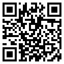
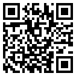
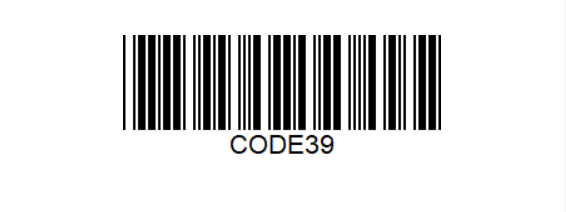
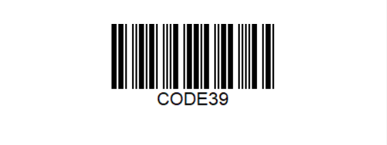
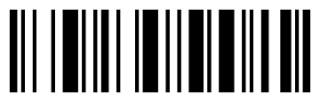
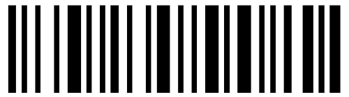
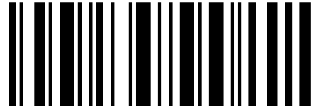
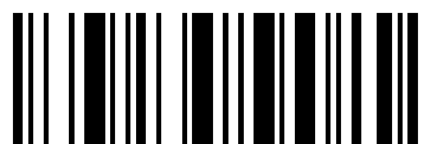

特定码型的配置参数
==================

本文介绍特定码型的配置参数FormatSpecification,及其分类下的相关参数。

1.  [BarcodeFormatIds,BarcodeFormatIds_2](#BarcodeFormatIds,BarcodeFormatIds_2)

指定当前FormatSpecification配置应用于的码型

2.  [MirrorMode](#MirrorMode)

指定是否需要解镜像条码

3.  [RequireStartStopChars](#RequireStartStopChars)

指定搜寻条码是否需要开始符与结束符

4.  [AllModuleDeviation](#AllModuleDeviation)

指定条码的码条尺寸与标准条码码条尺寸的偏差值

5.  [HeadModuleRatio，TailModuleRatio，Code128Subset](#HeadModuleRatio，TailModuleRatio，Code128Subset)

指定条码头部,尾部的码条数量和尺寸比例，指定条码属于哪个code128子集

6.  [StandardFormat](#StandardFormat)

指定标准条码码型

7.  [AustralianPostEncodingTable](#AustralianPostEncodingTable)

指定使用哪种解码表来解码AustralianPost条码中Customer information Field

8.  [MinQuietZoneWidth](#MinQuietZoneWidth)

指定条码静区的最小宽度

9.  [ModuleSizeRangeArray](#ModuleSizeRangeArray)

指定搜寻条码的码条尺寸范围

10.  [ReturnPartialBarcodeValue](#ReturnPartialBarcodeValue)

指定是否返回部分码值，未支持

11.  [FindUnevenModuleBarcode](#FindUnevenModuleBarcode)

详述是否寻找不规则条码，未支持

12. [示例](#示例)

BarcodeFormatIds,BarcodeFormatIds_2
-----------------------------------

此参数指定当前FormatSpecification配置应用于的码型

默认使用全局的[BarcodeFormatIds,BarcodeFormatIds_2]().

MirrorMode
---------

此参数指定是否需要解镜像条码。该参数有以下枚举

| 枚举名    | 枚举值 | 备注                 |
|-----------|--------|----------------------|
| MM_BOTH   | 0x04   | 镜像或正常的条码都解 |
| MM_MIRROR | 0x02   | 只解镜像条码         |
| MM_NORMAL | 0x01   | 不解镜像条码         |

默认值为MM_NORMAL
例图：
  &emsp;&emsp; 
 &emsp;&emsp;正常QR&emsp;&emsp;&emsp;&emsp;&emsp;&emsp;&emsp;镜像QR


RequireStartStopChars
---------------------

有可能存在非标准的条码，与正常的条码相比，少了头尾的开始符和结束符。此参数是为了读取这种非标准条码而设计，用于指定搜寻条码是否需要开始符与结束符。该参数可以设置为0或者1。0代表不需要开始符与结束符，从第一个字符开始解码；1则代表需要开始符与结束符（正常解码）。

应用场景示例：

标准的code39条码如图1所示：
<center>


图1
</center>


非标准的code39的条码如下图所示：
<center>


图2
</center>


Code39标准中定义开始符和结束符为{n,w,n,n,w,n,w,n,n}(n代表窄条，w代表宽条)的七段黑白条码，非标准code39条码中没有，如果正常解码（RequireStartStopChars设为1），将无法解出码值，将RequireStartStopChars设为0，可以解出该非标准条码码值。

AllModuleDeviation
------------------

此参数在FormatSpecification.BarcodeFormatIds_2设为NON_STANDARD_BARCODE有意义

有可能存在非标准的条码，他的所有码条宽度与标准条码的码条相比偏差了几个moduleSize（单倍码条的宽度）。AllModuleDeviation为了这种非标准码型而设计。如果存在偏差，我们在统计码条宽度时会考虑偏差，得到最终的宽度用于解码。

AllModuleDeviation取值范围为[0,0x7fffffff]，单位为moduleSize，默认值为0。

应用场景示例：
标准code128条码如图3所示：
<center>



图3
</center>
moduleSize为4Px
非标准条码图如图4所示：
<center>


图4
</center>
该非标准条码的没一段码条都比标准码条宽了1倍moduleSize。正常解码无法解出码值，所以我们可以设置AllModuleDeviation为1，这样在解码时就会考虑一倍moduleSize的偏差值，从而正确解出码值。


HeadModuleRatio，TailModuleRatio，Code128Subset
-----------------------------------------------

此参数在FormatSpecification.BarcodeFormatIds_2设为NON_STANDARD_BARCODE有意义

有可能存在非标准的条码，它的开始符和结束符与该非标准条码对应的标准条码规则中定义的不一样，可能是码条数量不一样也可能是码条比例关系不一样。HeadModuleRatio，TailModuleRatio这两个参数就是为了这种非标准条码而设计。默认值为””

HeadModuleRatio：设置开始符的码条数量和比例关系

TailModuleRatio：设置结束符的码条数量和比例关系

这两个参数设计为string类型，例如，我们设置HeadModuleRatio：”211412”,代表开始符码条数量为6条，比例关系为2：1：1：4：1：2。

Code128Subset参数为了解非标准Coide128设计，设置该用code128
A，B，C哪种子集规则来解条码码值。这个参数可以设置为”A”,”B”,”C”.默认值为””.

如果是要解非标准Code128，这三个参数必须全部设置，不能为默认值。

应用场景示例：
假如我们有一张非标准的code128条码图片，它的开始符比例关系为2：1：1：3：3：1，不符合code128标准定义的开始符的比例关系，结束符的比例关系为2：3：3：2：2：2：3也不符合标准的结束符。如图5所示：
<center>


 图5
</center>

标准条码如图6所示：
<center>


图6

</center>
如果不设置HeadModuleRatio和TailModuleRatio，是无法正确读取条码的。我们将HeadModuleRatio和TailModuleRatio分别设为”211331”和”2332223”则能够解出该非标准条码，Json模板示例如下：
```Javascript
{
    "ImageParameter": {
        "Name": "ImageParameter1", 
        "Description": "This is template demonstrate", 
        "BarcodeFormatIds": [
            "BF_ALL"
        ], 
        "LocalizationModes": [
            {
                "Mode": "LM_CONNECTED_BLOCKS"
            }
        ], 
        "DeblurLevel": 9
    }, 
    "FormatSpecificationArray": [
        {
            "Name": "FP_1", 
            "BarcodeFormatIds": [                 
                "NO_STANDARD_BARCODE"
            ], 
            //当前FormatoSpecification对应非标准码型
            "StandardBarcodeFormat": [
                "BF_CODE_128"                     
            ], 
            //当前非标准码型对应的标准码型为code128
            "HeadModuleRatio": "211331",          
            "TailModuleRatio": "2332223", 
            //设置非标准码型的头尾符比例
            "Code128Subset": "A"                 
             //设使用code128A子集规则解字符
        }
    ], 
    "Version": "3.0"
}
   
```

StandardFormat
--------------

此参数在FormatSpecification.BarcodeFormatIds_2设为NON_STANaDARD_BARCODE有意义

该参数用于指定非标准条码所对应的标准码型，如果FormatSpecification.BarcodeFormatIds设为NON_STANDARD_BARCODE，这个参数必须被设置，且必须被设置成某一特定码型，否则无法解码

AustralianPostEncodingTable
---------------------------

这个参数在FormatSpecification.BarcodeFormatIds_2设为BF2_AUSTRALIANPOST时有意义。

根据AustralianPost
code的标准定义，该条码存在一段客户信息区，该区域不仅可以使用标准中定义的两张解码表（N table，C table）来解码，也可以完全由客户自定义解码规则。目前暂不支持用户自定义解码规则，而是通过设置该参数来选择N table或C table来进行解码，有关这两张解码表的具体定义请参考AustralianPostcode[标准文档](https://auspost.com.au/content/dam/auspost_corp/mediai/documents/customer-barcode-technical-specifications-aug2012.pdf)中的说明。

该参数可设置为”C”或者”N”，默认值为”C”。若设置为”C”则使用C table解码，”N”使用N table解码。

MinQuietZoneWidth
-----------------

此参数用于指定条码静区的最小宽度，只在1D条形码解码起作用。

静区的概念：条形码左右两侧的空白区域。

此参数取值范围为[0,0x7fffffff],单位为ModuleSize（单倍条的宽度），默认值为4。

如果1D条码左侧或右侧静区的宽度小于MinQuietZoneWidth\*moduleSize的值，该条码将不能被解出。

ModuleSizeRangeArray
--------------------

此参数用于指定在搜寻条码时，条码的ModuleSize需要满足的范围，不满足条件的条码将不会被解出。

默认值为空，意为不对条码的moduleSize做限制。

设置范围为[0,0x7fffffff],单位为像素。

ReturnPatrtialBarcodeValue
--------------------------
未支持

FindUnevenModuleBarcode
---------------------------------
未支持

示例
-------

示例Json模板如下：
```Javascript
    {
    "ImageParameter": {
        "Name": "ImageParameter1", 
        "Description": "This is template demonstrate", 
        "BarcodeFormatIds": [
            "BF_ALL"
        ], 
        "LocalizationModes": [
            {
                "Mode": "LM_CONNECTED_BLOCKS"
            }
        ], 
        "DeblurLevel": 9
    }, 
    "FormatSpecificationArray": [
        {
            "Name": "FP_1", 
            "BarcodeFormatIds": [                 
                "NO_STANDARD_BARCODE"
            ], 
            //当前FormatSpecification对应非标准码型
            "StandardBarcodeFormat": [
                "BF_CODE_39"                     
            ], 
            //对应的标准为code39
            "AllModuleDeviation":1,
            //条码偏差值为1倍moduleSize
            "MinQuietZoneWidth":3,
            //条码左右静区宽度最小为3倍moduleSize
            "MirrorMode":"MM_BOTH"，
            //解镜像和正常的条码
            "ModuleSizeRangeArray"
            [
            {
            "MaxValue":100,
            "MinValue":10
            }
            ],
            //只解moduleSize在10Px~100Px之间的条码
           "RequireStartStopChars":1
           // 解有头尾字符的条码               
           ], 
    "Version": "3.0"
}
```


